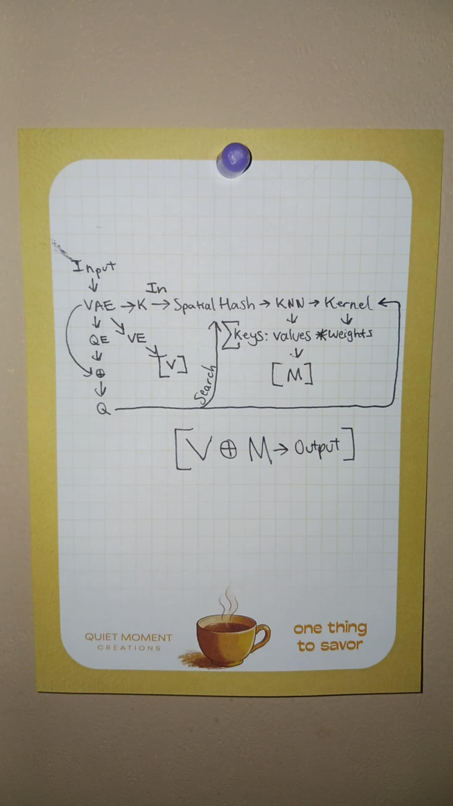

# World-ARM: World Model with Associative Recall Memory instead of hallucinating from scratch!

# Part 4

## Backstory
Giving up didn't seem to enable me to stop thinking about this problem. However, I think that writing down my last iteration of a solution to the problem, just might. I can finally put this down. Not that I have to, but I want to now. 

You see, I was let go from Color Switch. In a dispute about salary, I was demoted. I refused the demotion, so I was terminated. I think it took me all of a year to finally have that sink in. So on the one hand, I had to let go.

On the other hand, I took with me, a large severance; which included a large amount of machine learning IP ownership & more. Not the least of which worth mentioning, was an entire mobile game I built while I was working at the company. While this wasn't directly apart of the severance, it was left undisputed that it belonged soley to me. 

The game in question? A Color Switch sequel. Not Color Switch 2. Color Switch with procedurally generated worlds soley based on Flow-ish Maps. You know the game "Flow Free"? That's how I decided to make all the maps in the game. 5 gameplay styles similar to the original Color Switch modes. Albeit, they are played on maps that are shaped like Flow Free grids. It was essentially a technical achievement layered on top of the original game. All procedurally generated & tested automatically with player progression analysis. Just a tad bit of a flex.

The business relations officer of Color Switch gave me permission to include any of Color Switch's source code in this new game. The day he did that, I moved the sparse mixture of experts, the pieces of hyper associative recall memory, and many more important gameplay related features to the game. Yet, I never integrated any of it. Nothing stopped me from picking up my pieces, inspired by Rovio's pioneering ML work, and finally having the chance to observe automated KPI scaling.

"Color Flow" as it became to be known, could become my new machine learning laboratory. Maybe I could close the loop on something else too.

So here it is, without further ado. Version 4 is purely a conceptual design, based on nothing but vibes, and first principles intuition. All jokes aside, I think the work speaks for itself, even in this abstract state. 

And I know I said, without further ado, but before I begin I think I'll say one more thing. "Product managers need to have 4-5 versions of their product, not only in their head, but partially researched & developed while they are on version 1". Which is why the Oculus 5 is sitting on a shelf somewhere that only researchers have access to. 

Lets update the inputs and targets of associative recall memory. The memory module keeps track of temporal observations and actions. Those are the inputs. And the output? The same but think timestep t+1 & actions. The input to the query encoder becomes latent image (CNN AE becomes a VAE) output + actions. The output becomes timestep t+1. ARM style memory retrieval does the rest. ARM + state as the target = World Model. 

Not just any world model, but a world model where its predictions are not hallucinated from scratch. Rather, they start from memories. I'd update the image, but it's essentially identical to the notebook paper ARM sketch. Memory insertion, could be similar to MFEC style insertions. Something I became familiar with after some additional research. So similar to what I assumed would be necessary for memory management, but concisely explained. With that, the final architecture would be complete. However, only conceptually, because take for consideration I never got to build it. Nor did I ever fully decide on whether the World-ARM and ARM would be separate communicating blocks or consolidated. I think the former would have more flexibility, modularity, interpretability, and algorithmic control.

While version 4 might never be tested, it does expand the cognitive architecture a step further. Which in turn makes me think of Jurgen Schmidhuber & David Ha, to whom I would say, thank you. Why didn't you add MCTS to your original world model paper? I wouldn't be surprised if it was something along the lines of the same reason Craig Reynolds didn't add a Spatial Hash. The same reason ARM isn't end-end differentiable, or why I haven't swapped out the spatial hash for something more principled, and the same reason I'm not adding it to this paper other than say to its obvious that search is a necessary component. 

As the developers of actual projects, we have to think about version 4, and version 5. Maybe version 5 irons out all the wrinkles and then I add MCTS on the top, and maybe even heirarchical blocks, and we see the system really purr along. It's just not the step we're on.

I'd like to note that I'm using ARM & Hyper-ARM almost too flexibly. Every time I said ARM, I meant Hyper-ARM. Its just becoming a mouth full. World-Hyper-ARM? Hyper-ARM-World? The first sounds like buzz word vomit. The second sounds like a dimension of gym bros. Yeah the naming convention gets a bit fuzzy at that point.

Maybe I'll address one more question too. Such as, how would it plan in states that it has no memories of? What's MCTS going to plan?

Yeah the idea of world arm not being able to "plan in states without memories" is a real issue but I also thought through experimentation I could address it. Importantly, the idea of not predicting actions with the world model is huge. Having separate blocks would be necessary in a situation like this. Action prediction in the original ARM block and future latent state prediction in the World ARM block. How is this a solution? Well basically, the latent image embedding can be predicted in the same way as even the original "World Model" paper. Albeit, starting with a memory first. Now in this setup, maybe a secondary residual, basically just informed after a value encoder projection is used. In a setup like that, the "weights * values" part would just be a helper function basically conditioned on memory. The next part of the World-ARM block would do what any world model all ready does. Just learns higher resolution future latents. Then MCTS becomes possible with this dual ARM block setup. Pretty damn clean and neat huh?

Anyways, this dumb, yet brilliant idea, it was all me. I get the credit, I get some congratulations, and now I finally have the confidence enough to pick my head up and say - "I think I might have found something". Without the delusion of actually believing I'll hear any other response but "Is this what you think you found?" followed by a cited paper or an academic roast.

### Original Diagram
